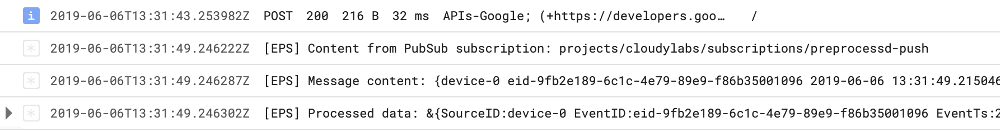

# preprocessd

Simple example showing how to use Cloud Run to pre-process raw events from PubSub and publish them to new topic.

In many cases the raw data from the ingestion point (e.g. IoT event stream) needs to be pre-procesed before it can be used (e.g. to build ML model for prediction service). Cloud Run is a great platform to build these pre-processing services:

* Write each one of the pre-processing steps in the most appropriate (or favorite) development language
* Bring your own runtime (or even specific version of that runtime) along with custom libraries
* Dynamically scale up and down with your PubSub event load
* Scale to 0, and don't pay anything, when there is nothing to process
* Use granular access control with service account and policy bindings

## Event Source

In this example will will use the synthetic events on PubSub topic generated by [pubsub-event-maker](https://github.com/mchmarny/pubsub-event-maker) utility. We will use it to mock synthetic `utilization` data from `3` devices and publish them to Cloud PubSub on the `eventmaker` topic in your project. The PubSub payload looks something like this:

```json
{
    "source_id": "device-1",
    "event_id": "eid-b6569857-232c-4e6f-bd51-cda4e81f3e1f",
    "event_ts": "2019-06-05T11:39:50.403778Z",
    "label": "utilization",
    "mem_used": 34.47265625,
    "cpu_used": 6.5,
    "load_1": 1.55,
    "load_5": 2.25,
    "load_15": 2.49,
    "random_metric": 94.05090880450125
}
```

The instructions on how to configure `pubsub-event-maker` to start sending these events are  [here](https://github.com/mchmarny/pubsub-event-maker).

## Configuration

Throughout this example we are going to be using your Google Cloud `project ID` and `project number` constructs. This are unique to your GCP configuration so let's start by capturing these values so we can re-use them throughout this example:

```shell
PRJ=$(gcloud config get-value project)
PRJ_NUM=$(gcloud projects list --filter="${PRJ}" --format="value(PROJECT_NUMBER)")
```

## Service Image Build

Since the deployment unit of Cloud Run is a container, let's start by submitting build job to build an image from the code in this repository. In the root of the project run:

```shell
gcloud builds submit --tag gcr.io/${PRJ}/preprocessd:0.1.5
```

> If this is first time you use the build service you may be prompted to enable the build API

## Service Deploy

Once the build process completed, you will have an image ready for use in Cloud Run. To deploy that image run this command:

```shell
gcloud beta run deploy preprocessd \
	--image=gcr.io/${PRJ}/preprocessd:0.1.5 \
	--region=us-central1 \
	--concurrency=80 \
	--memory=256Mi
```

> When prompted to "allow unauthenticated" select "n" for No. That will set that service private so that we can use service account later to enable PubSub to "push" evens to this service.

Once deployment is completed, make sure to capture the URL that's generated for this service. Also, by default, this service will publish the processed events into topic titled `processedevents`. If that topic doesn't exists, it will be created. If you like to publish to another topic or a topic that already exists, you can add an environment variable to the above command to specify the target topic.

```shell
--update-env-vars="TOPIC=my-special-topic"
```

## Service Account & Authorization

Because this Cloud Run service will only process events pushed from Cloud PubSub, we will need to create a service account and ensure that only that service account is able to invoke the Cloud Run service.

First, let's though enable your project to create Cloud Pub/Sub authentication tokens:

```shell
gcloud projects add-iam-policy-binding $PRJ \
    --member="serviceAccount:service-${PRJ_NUM}@gcp-sa-pubsub.iam.gserviceaccount.com" \
    --role=roles/iam.serviceAccountTokenCreator
```

Then let's create a service account (`preprocessdinvoker`) that will be used by PubSub to invoke our Cloud Run service:

```shell
gcloud iam service-accounts create preprocessdinvoker \
    --display-name "PreProcess Cloud Run Service Invoker"
```

Now we can create a policy binding for that service account to access our Cloud Run service

```shell
gcloud beta run services add-iam-policy-binding preprocessd \
	--member=serviceAccount:preprocessdinvoker@${PRJ}.iam.gserviceaccount.com \
	--role=roles/run.invoker
```

## PubSub Subscription

To enable PubSub to send topic data to Cloud Run service we will need to create a PubSub topic subscription called `preprocessdsub`.

> Note, if you changed the default target topic in `pubsub-event-maker` you may have to update the `--topic eventmaker` portion of this command

Cloud Run generates service URL including random portion of the service name so let's capture the URL:

```shell
SURL=$(gcloud beta run services describe preprocessd --region us-central1 --format 'value(status.domain)')
```

Now we are create the PubSub push subscription:

```shell
gcloud beta pubsub subscriptions create preprocessdsub \
	--topic eventmaker \
	--push-endpoint="${SURL}/" \
	--push-auth-service-account="preprocessdinvoker@${PRJ}.iam.gserviceaccount.com"
```

## Log

When running the `` service you can see in the Cloud Run service log tab the raw data that was pushed by PubSub subscription to the service and the processed data that was pushed onto the target topic



## Disclaimer

This is my personal project and it does not represent my employer. I take no responsibility for issues caused by this code. I do my best to ensure that everything works, but if something goes wrong, my apologies is all you will get.


